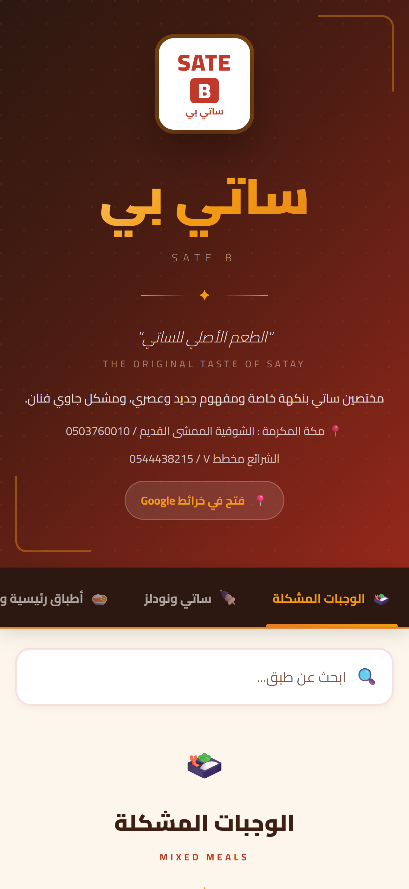
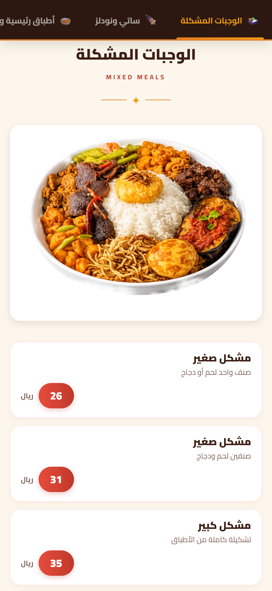
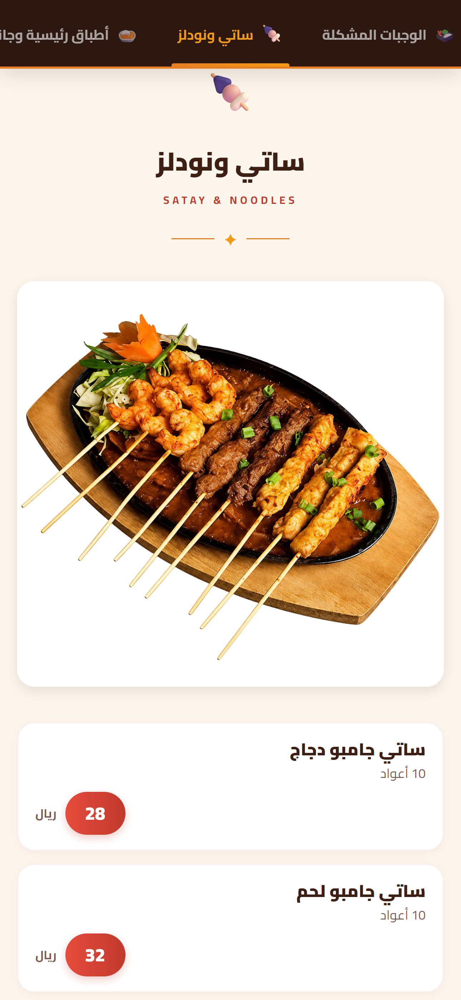

# 🍢 Sate B — Digital Menu

<div align="center">


**An Arabic digital menu for Sate B, an Indonesian satay restaurant in Makkah.**

**[🚀 Live Demo](https://effulgent-queijadas-bbb34b.netlify.app/)**

</div>

---

## 📖 About the Project

**Sate B Digital Menu** is a community service project built for CPIT-380 at King Abdulaziz University. The goal was to modernize the dining experience at a local Indonesian restaurant by replacing a crowded printed menu with a clean, responsive digital alternative.

---

## 🔄 Before & After

<table>
  <tr>
    <td align="center" width="48%">
      <strong>❌ Before — Original Printed Menu</strong><br/>
      <br/>
      <sub>Heavy red background · Crowded layout · Low readability</sub>
    </td>
    <td align="center" width="48%">
      <strong>✅ After — New Digital Menu</strong><br/>
      <br/>
      <sub>Clean cream layout · Modern UI · Premium presentation</sub>
    </td>
  </tr>
</table>

---

## ✨ Features

- 🌐 **Arabic RTL Interface** — right-to-left layout with English brand labels
- 📱 **Mobile-First Design** — optimized for phone/tablet use at the table
- 🔍 **Real-Time Search** — instantly filter menu items by name
- 🗂️ **Sticky Category Navigation** — smooth-scroll category tabs
- 🖼️ **Visual Menu Items** — featured dishes with high-quality images
- ⭐ **Featured Highlights** — popular items marked with badges
- 🎨 **Premium Aesthetic** — Indonesian-inspired warm color palette

### 🎨 Design System

| Element | Value |
|---|---|
| **Primary Color** | `#C0392B` (Crimson) |
| **Accent** | `#F39C12` (Amber Gold) |
| **Background** | `#FDF6EC` (Warm Cream) |
| **Typography** | Cairo + Tajawal (Google Fonts) |
| **Layout** | RTL Arabic with responsive grid |
| **Framework** | Vanilla HTML/CSS/JS (Zero dependencies) |

---

## 📸 Screenshots

<table>
  <tr>
    <td align="center" width="33%">
      <br/>
      <sub>Homepage</sub>
    </td>
    <td align="center" width="33%">
      <br/>
      <sub>Mixed Meals</sub>
    </td>
    <td align="center" width="33%">
      <br/>
      <sub>Satay & Noodles</sub>
    </td>
  </tr>
</table>

---

## 🍽️ Menu Categories

| # | Category | Description |
|---|---|---|
| 1 | الوجبات المشكلة | Mixed meals combos & bao buns |
| 2 | ساتي ونودلز | Satay skewers & Indonesian noodles |
| 3 | أطباق رئيسية وجانبية | Main dishes with visual menu items |
| 4 | المشروبات | Soft drinks & beverages |

---

## 📱 QR Code Access

Scan to open the menu directly on your phone — no download needed.

<div align="center">
  
  <br/>
  <sub>Point your camera at this code to open the menu instantly</sub>
</div>

---

## 📂 Project Structure

```
SateB-Digital-Menu/
├── index.html              # Main application (single file)
├── images/
│   ├── Main Side/          # Main dish photography (1-12)
│   ├── bao.jpg             # Bao buns hero image
│   ├── noodles.jpg         # Noodles hero image
│   ├── satay-hero.png      # Satay section banner
│   └── mixed-meals-hero.png
├── Agent/
│   ├── Info/               # Owner feedback, QR code & project report
│   ├── Before/             # Original printed menu photos
│   └── Preview_Shots/      # Screenshots & QR codes
└── README.md
```

---

## 🛠️ Technologies Used

| Category | Choice |
|---|---|
| **Structure** | Semantic HTML5 |
| **Styling** | Pure CSS (no frameworks) |
| **Logic** | Vanilla JavaScript ES6+ |
| **Fonts** | Google Fonts (Cairo, Tajawal) |
| **Hosting** | Netlify (auto-deploy from GitHub) |
| **Version Control** | Git + GitHub |

---

## 🚀 Deployment

Auto-deploys to **Netlify** on every push to `master`.

```
GitHub Repo → Netlify → Live URL
```

**Live URL:** https://effulgent-queijadas-bbb34b.netlify.app/

---

## 📊 Owner Evaluation Results

Restaurant owner evaluated the digital menu across 10 criteria — all perfect scores.


> *"Excellent work in all aspects — no further notes needed."*
>
> — Restaurant Owner, Sate B · May 2026

---

## 💡 Impact

| Group | Benefit |
|---|---|
| **Restaurant Customers** | Faster, easier browsing on smartphones |
| **Restaurant Staff** | Faster ordering process, fewer questions |
| **Restaurant Management** | Modern brand tool, better customer engagement |

---

## 📌 Future Enhancements

- [ ] Online ordering — direct order placement through the menu
- [ ] Multi-language toggle (AR/EN)
- [ ] Promotional offers & seasonal daily specials
- [ ] QR code generator for table placement
- [ ] Customer analytics — insights on popular dishes
- [ ] Order cart functionality
- [ ] Nutrition info & allergen warnings
- [ ] Continuous menu content management system

---

<div align="center">

Built with ❤️ for Sate B Restaurant, Makkah

⭐ *Star this repo if you found it useful!*

</div>
